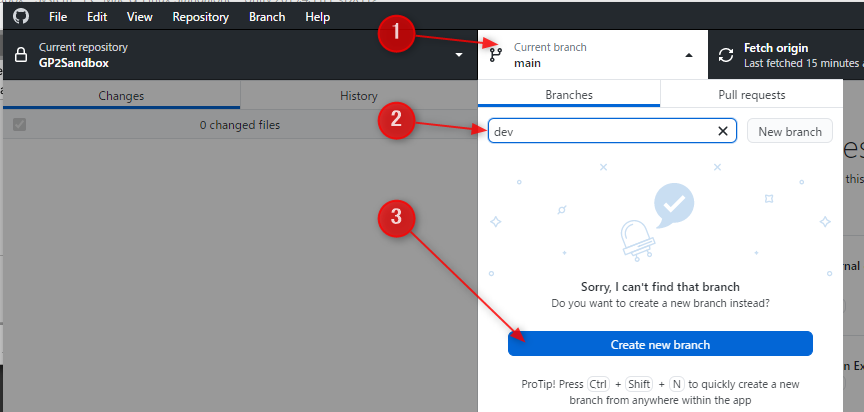
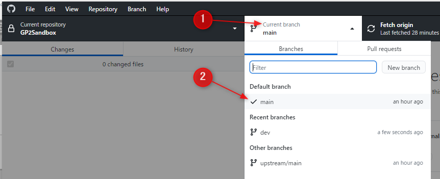
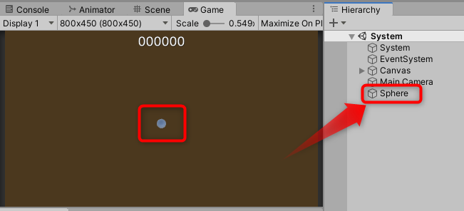

# チーム開発の準備

チーム開発に向けたGitの機能を練習します。

## ブランチ
Gitはオープンソースプロジェクトの開発を想定したツールです。リポジトリーを公開して、常に誰からアクセスされても構わないようにしておくのが基本です。

開発途中で作業時間が終わった場合に、そのままコミットとプッシュをすると、エラーがでるような状態のプロジェクトになってしまいます。これだとそのプロジェクトを使ってみたい人にとっては不便です。かといって、エラーがでない状態になるまでプッシュができないというのも不便です。

そこで、バージョン管理システムには**ブランチ**というものが用意されています。日本語で **枝** のことで、リポジトリーを枝分かれさせて、複数の状態を同時に保存できるようにするものです。

最初に割り当てられる**main** (以前は **master** )ブランチは、常に動作可能な状態にしておくのが一般的です。開発をする時にはmainから開発用のブランチを作成して、その開発用のブランチにコミットやプッシュをします。ブランチは独立しているのでmainブランチは動作する状態が維持されます。

開発が一段落して問題なく動作するようになったら、開発用ブランチをmainブランチに **マージ(=merge 結合)** します。これでmainブランチは常に動作する状態に保つことができます。開発を続行する時は、先の開発用ブランチで再び作業をするか、新しい開発用のブランチを作成して作業します。

理解を深めるために、実際に操作をしてみましょう。

### ブランチを作る
開発用のブランチ`dev`を作成してみます。ブランチを切り替える操作をする際には、以下の2点に注意してください。

- ブランチの操作をする前に、変更中のファイルを0にします
- ブランチの切り替え操作中は、Unityに切り替えないでください

変更中のファイルがある状態でブランチを切り替えると状態の把握が難しくなります。作業中のファイルならコミット、変更を破棄して構わないならDiscardをしましょう。

ここでは何も変更をしていないはずなので、ChangesにファイルがあったらDiscard Allで変更を戻しておいてください。

1. Current branchをクリック > Filter 欄に`dev`と入力 > Create New branch ボタンを押します

2. 続けて Create branch ボタンを押します

これで開発用のブランチ`dev`ができました。少し変更を加えてみます。

1. Projectウィンドウから GP2Sandbox > Scenes フォルダーを開いて、 System シーンをダブルクリックして開きます
1. Hierarchyウィンドウの + をクリックして、3D Object > Sphereを選んで球体を作ります
1. Fileメニューから Save を選択して保存します
1. Summary欄に`Sphereを作成`などと入力してコミットします

以上でdevブランチに変更を加えてコミットしました。それではmainブランチに切り替えてみます。

1. GitHub DesktopのCurrent branchをクリックして main を選択します

2. Unityに切り替えてReloadボタンをクリックします

mainブランチはdevブランチを作成した時点の状態のままなので、先ほど作成したSphereがなくなって元の状態に戻ったことが確認できます。

同様の操作でdevブランチに戻してみましょう。

1. GitHub DesktopのCurrent branchをクリックして dev を選択します
1. Unityに切り替えて、Reloadボタンをクリックします

Sphereが復活します。

このようにブランチを作成して切り替えることで、プロジェクトを様々な状態で管理することができます。**ファイルを変更したままブランチを切り替えない限り**、マージを実行しなければ他のブランチを破壊することはありません。

この性質を利用して、常にリポジトリーのmainブランチを実行可能な状態に保ったり、複数のメンバーが別々にプロジェクトの開発を進めます。

## マージ

開発が一段落して動作可能な状態になったら、開発ブランチで行った作業をmainブランチに結合します。これを **マージ(Merge)** と呼びます。

devで追加したSphereを、mainブランチにも反映させてみます。マージは **マージ先のブランチに切り替えて、マージ元のブランチを指定** します。

1. GitHub DesktopのCurrent branchを、**マージ先**であるmainに切り替えます
1. ブランチの切り替えが完了したら、Unityを選択してReloadして変更を反映させます
1. GitHub Desktopに切り替えて、Current branchをクリックして、一番下の Choose a branch to merge into main をクリックします

4. マージ元のdevブランチをクリックして選択して、 Merge dev into main をクリックします

以上でマージ完了です。Unityに切り替えてReloadをしてください。mainブランチにもSphereが追加されます。Push origin すればGitHubにも更新が反映します。

一人で開発するには、これでmainを動作する状態に保って開発が進められます。

## チーム開発を検討する

ブランチの作成方法とマージの仕方が分かりました。チームメンバーを共同開発者にして、メンバーそれぞれが自分の作業用のブランチを作って、そこで作業して、mainブランチにマージをすれば共同開発ができそうな雰囲気です。試してみましょう。

### シナリオ
- AさんとBさんが同時に開発します
- Aさんはdev、Bさんは新しくdevBブランチを作成してそこで作業をします
- AさんはSphereをGameシーンに移動する作業を担当します
- BさんはGameシーンにCubeを作成して配置を担当します

一人でAさんとBさんの役になって作業を進めてみましょう。

### 作業手順

まずはAさんの作業をします。

次にBさん役になって作業を進めます。

- mainブランチに切り替えます
- UnityでReload
- devBブランチを作成
- Systemシーンを開いて状態確認
- Gameシーンを読み込み
- ちょっとSphereを動かしてしまう

Aさんが作業を完了してmainへマージ。
続けてBさんもmainへマージ。

さて、何が起きるか。

## コンフリクトを発生させる

## コンフリクトの解消方法

## コンフリクトを避けるには
